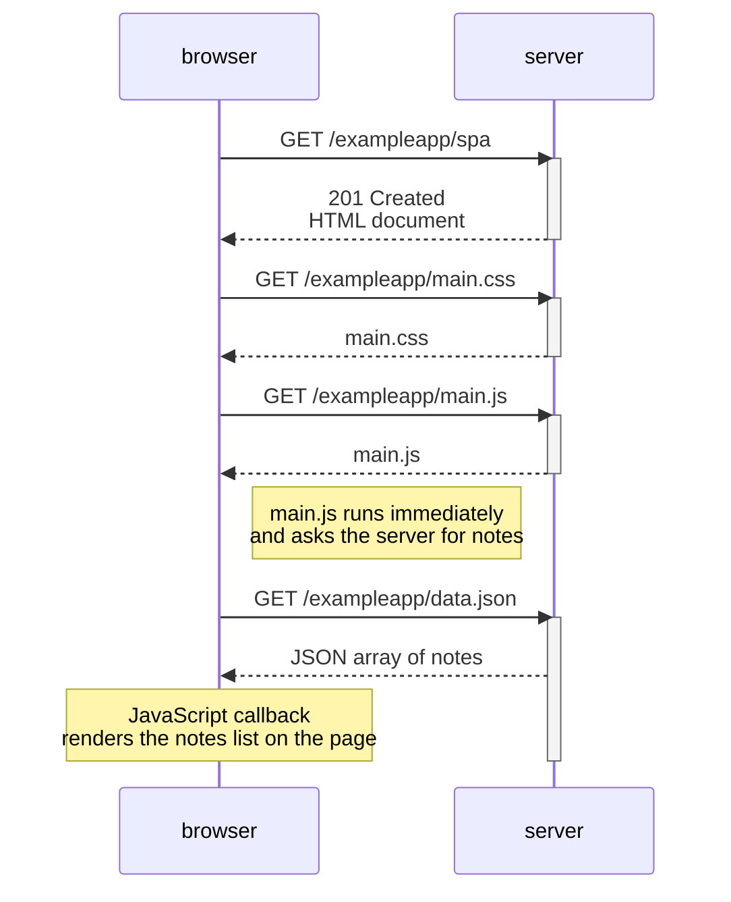

```mermaid
sequenceDiagram
    participant browser
    participant server

    %% 1 – INITIAL PAGE REQUEST
    browser->>server: GET /exampleapp/spa
    activate server
    server-->>browser: 201 Created <br/>HTML document
    deactivate server

    %% 2 – STATIC ASSETS FOR THE SPA SHELL
    browser->>server: GET /exampleapp/main.css
    activate server
    server-->>browser: main.css
    deactivate server

    browser->>server: GET /exampleapp/main.js
    activate server
    server-->>browser: main.js
    deactivate server

    %% 3 – SPA BOOTSTRAP: FETCH DATA
    Note right of browser: main.js runs immediately<br/>and asks the server for notes
    browser->>server: GET /exampleapp/data.json
    activate server
    server-->>browser: JSON array of notes
    Note over browser: JavaScript callback<br/>renders the notes list on the page
    deactivate server
```
   
    

    