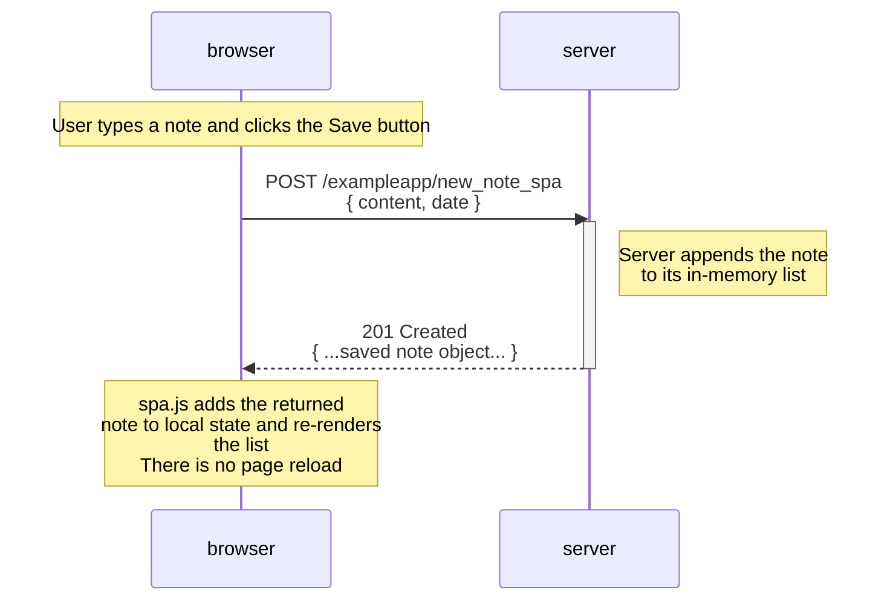

```mermaid
sequenceDiagram
    participant browser
    participant server

    %% USER ACTION
    Note over browser: User types a note and clicks the Save button

    %% 1 – AJAX POST FROM SPA
    browser->>server: POST /exampleapp/new_note_spa<br/>{ content, date }
    activate server
    Note right of server: Server appends the note<br/>to its in-memory list
    server-->>browser: 201 Created<br/>{ ...saved note object... }
    deactivate server

    %% 2 – CLIENT-SIDE UPDATE
    Note over browser: spa.js adds the returned<br/>note to local state and re-renders<br/>the list <br/> There is no page reload

```